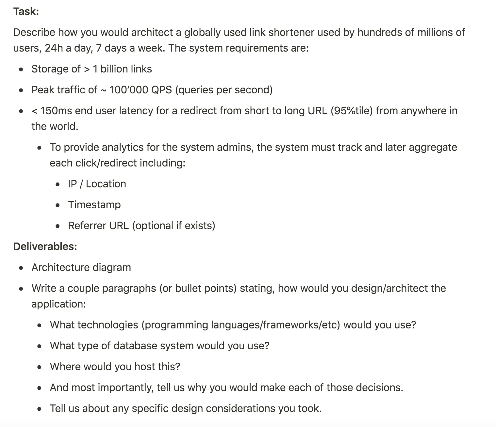

## 1 таск
Нужно было реализовать дома за пару дней

One important part of any multi-user collaboration tool's backend is the merge algorithm, which makes sure that actions of several users on a common document result in all of them eventually seeing the same result locally. Your home-task is to implement such an algorithm for a simple data structure.

Algorithm to implement:

- In the initial state "Server" process holds an array (ordered) of 10,000,000 32-bit integer random numbers. (Your algorithm should not rely on the fact that these elements are integers. This assumption was made for simplicity. Your algorithm should still work if each element was ~16-64 bytes each - just no need to do it).
- At any time a client process can connect, download the current state and start inserting, updating, or deleting numbers (each time choosing a random position for the operation and in case of insertion/update - choosing a random integer) at a speed of around 5 operations per second.
- There can be up to 20 clients connected at the same time
- State should be eventual consistent:
- Change made by any client should be present in every other client's state + the server's state within 1 second. Therefore if everyone stops pushing new operations - everyone's state should be equal within a similar 1 second.

Requirements:

- We are interested in an efficient implementation of the replication algorithm itself - and not whether you can write network code, REST/websocket apis e.t.c. Therefore feel free to implement the algorithm inside one executable running on multiple threads. Or to further minimize amount of boilerplate code - having a single threaded executable where clients' and server functions are called one after another in a loop. But in this case please don't use the fact that every client has the same current time because in real life clients would be on different machines and their local time is not guaranteed to be exactly the same.
- Feel free to choose a language you like, such as Go, C++, Java, Python e.t.c.
- We care about the efficiency of the implementation - how much data needs to be sent around, how complex the calculations are to reconcile the state e.t.c. Feel free to make trade-offs (CPU time vs RAM vs Network traffic) similar to how you would do it if you had to design such a system in real life in production serving 1mln+ users that can be connected via 3G/4G, not only high speed broadband. Feel free to ask any clarifying questions.
- Do not use external libraries that solve the data synchronization problem. We are interested in your ability to design efficient algorithms, not your github/stackoverflow search skills.

Bonus points:

- Think how would the algorithm work if one or several clients can work "offline" for a few hours and the state needs to be reconciled once they are back online.

After you complete the hometask and the team is happy with the solution - we will schedule a virtual on-site, during which we will ask you for the backend architecture design questions that are the extensions of this task. An example of a question could be: "Now let's assume we want to release this to production for 1mln Daily active users - how would you architect the backend system to handle it?"

Good luck!

##

По сути решение в CRDT/OT (Conflict-free replicated data type / Operational Transformations), код можно тута найти
https://github.com/RinesThaix/HomeTask
И там еще это
Поскольку операция вставки/удаления из массива работает за O(n), а итерация по 10млн элементам занимает около 20мс, то обработка уже 100qps привело бы нас к ожиданию в 2с, что неприемлемо. Была реализована собственная структура данных, в которой амортизированная оценка вставки, удаления и получения элемента по индексу O(1)*, ее можно найти в util/array.go: чем-то напоминает sqrt-декомпозицию, т.к. состоит из блоков примерно равного размера.

## 2 таск
задача в реалтайме решить
